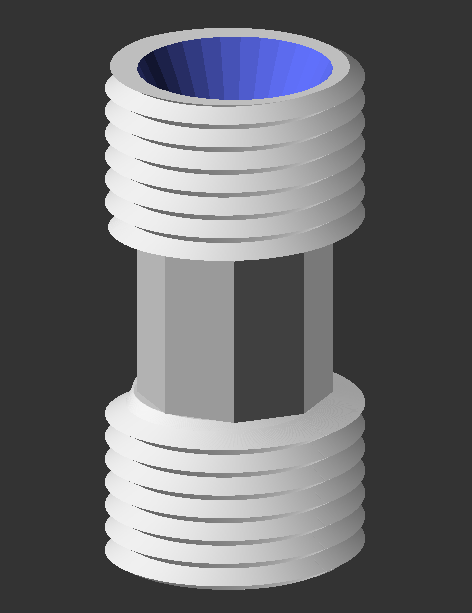
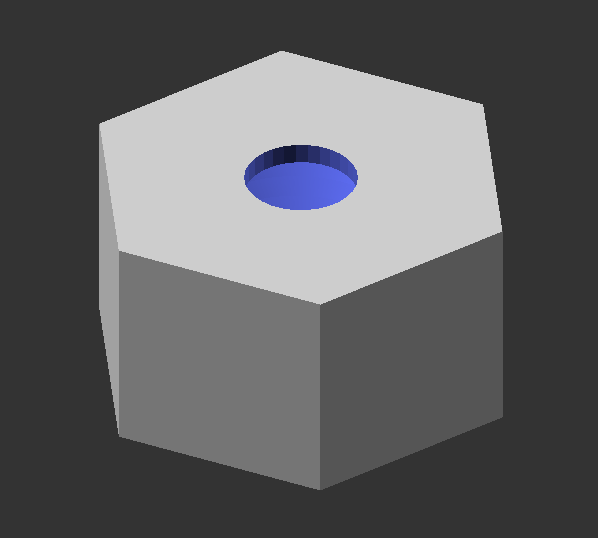
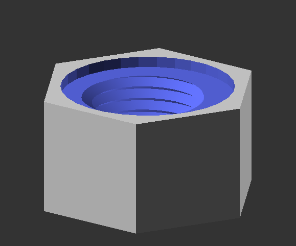

# pipe-fitting-SCAD
OpenSCAD script for generating pipe fittings parametrically.

## Overview
This repository contains a script for modeling a pipe fitting assembly, complete with gaskets, threaded nuts, and customizable pipe fittings. The script is designed for use in OpenSCAD and offers extensive customization for each component.

## Example Renders

## Dependencies
- OpenSCAD software.
- `threads-scad` library by rcolyer, available at [rcolyer/threads-scad](https://github.com/rcolyer/threads-scad).

## Installation
1. Ensure OpenSCAD is installed on your system.
3. Download the `threads-scad` library as well as this `pipe-fitting-scad` library.
3. Place both libraries in the OpenSCAD libraries directory (typically at `C:\Program Files\OpenSCAD\libraries` on Windows).

## Usage
Modify the dimensional variables at the beginning of the script to customize the pipe, gasket, fitting, nuts, and threads. Example usage is provided within the script for quick testing and adaptation.

## Contributing & Requests
Contributions to improve the script or extend its capabilities are welcome. Please submit pull requests with clear descriptions of changes and additions. Similarly, submit an issue to request a fix or addition with a clear description of the bug or feature to be addressed.

## License
This script is licensed under the GPL 3.0 or later. For more details, see the [LICENSE](LICENSE) file.

## Organization
[FAST Research Group](https://www.appropedia.org/FAST)