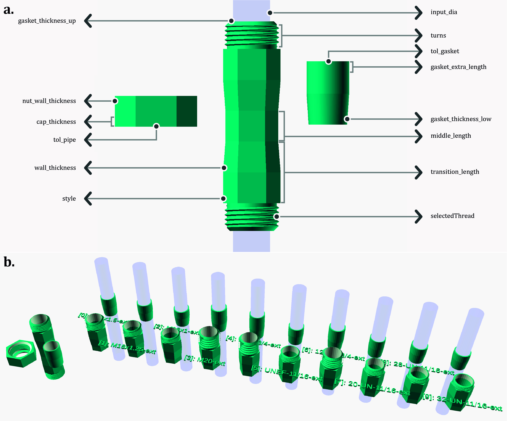
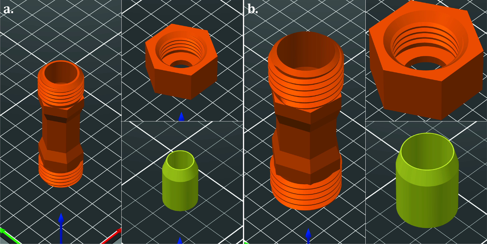
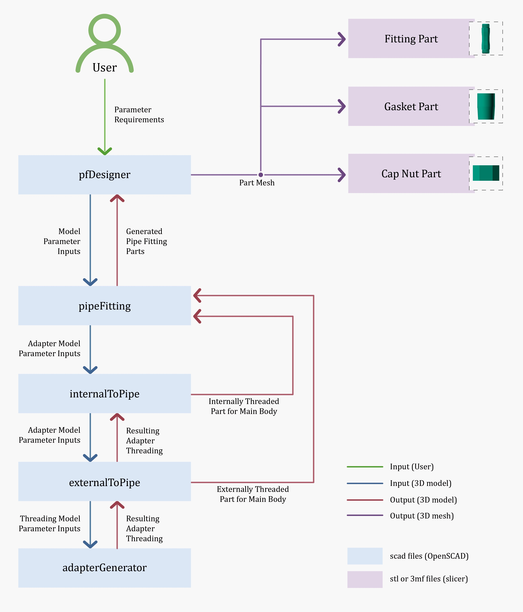

# pipe-fitting-SCAD

OpenSCAD script for generating pipe fittings parametrically.

## Overview

This repository contains a script for modeling a pipe fitting assembly, complete with gaskets, threaded nuts, and customizable pipe fittings. The script is designed for use in OpenSCAD and offers extensive customization for each component while adhering to existing industry thread standards.

**Note:** By using this library, you accept full personal responsibility for its use and any resulting outcomes, and irrevocably agree to the terms outlined in the [legal disclaimer](docs/DISCLAIMER.md). _In short, you are agreeing to assume all risks associated with its use._

## Dependencies

- OpenSCAD software.
- `threadlib` library by adrianschlatter, available at [adrianschlatter/threadlib](https://github.com/adrianschlatter/threadlib).

## Installation

1. Ensure OpenSCAD is installed on your system.
2. Download the `threadlib` library as well as this `pipe-fitting-scad` library.
3. Place both libraries in the OpenSCAD libraries directory (typically at `C:\Program Files\OpenSCAD\libraries` on Windows).

## Usage

### Creating your Fitting

Modify the dimensional variables at the beginning of the pfDesigner.scad script to customize the pipe, gasket, fitting, nuts, and threads.

### Manufacturing your Fitting

_Add part here about pettings and materials from paper._

### Performance Testing

NOTE THIS IS NOT A GAURENTEE OF SAFETY, ALWAYS CONDUCT YOUR OWN TESTING AND ALWAYS TAKE PROPER SAFETY PERCAUTIONS WHEN WORKING WITH HIGH PRESSURES.
_Add a laymans terms of the results from the paper here._

## How it Works

## Contributing & Requests

Contributions to improve the script or extend its capabilities are welcome. Please submit pull requests with clear descriptions of changes and additions. Similarly, submit an issue to request a fix or addition with a clear description of the bug or feature to be addressed.

## License

This script is licensed under the GPL 3.0 or later. For more details, see the [LICENSE](LICENSE) file.

## Acknowledgement

This was originally created by Cameron Brooks under the auspices of [FAST Research Group](https://www.appropedia.org/FAST) and published in [add when published]. This design uses [threadlib by Adrian Schlatter](https://github.com/adrianschlatter/threadlib) and inspiration from [Makrokaba's pipe joint generator](https://www.thingiverse.com/thing:4323468/files).
